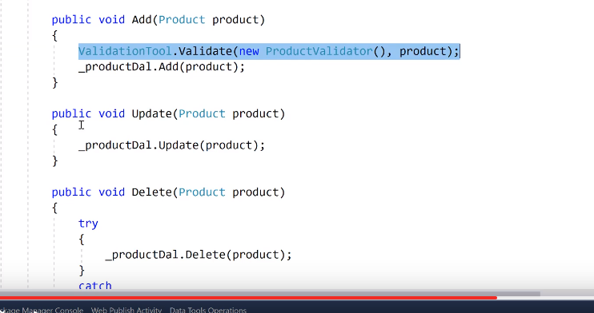
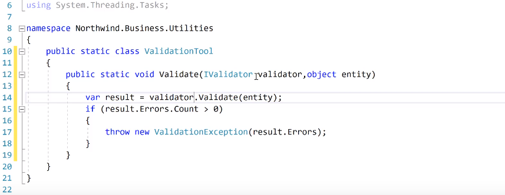

# Validator


ValiditionRules klasörünün içerisine

FluentValidation klasörü açılır ve içerisine bir class türetilir.

ProductValidator-&gt;Class

AbstractValidator dan inherit edilmesi gerekir. Of&lt;Product&gt;

Constractur oluşturulur ve içerisine

RuleFor\(p=&gt;p.ProductName\).NotEmpty\(\);

RuleFor\(p=&gt;p.CategoryId\).NotEmpty\(\);

RuleFor\(p=&gt;p.UnitPrice\).NotEmpty\(\);

RuleFor\(p=&gt;p.QuantityPerUnit\).NotEmpty\(\);

RuleFor\(p=&gt;p.UnitPrice\).GreaterThan\(0\); -&lt; sıfırdan büyük olmalı

RuleFor\(p=&gt;p.UnitPrice\).GreaterThan\(10\).When\(p=&gt;p.CategoryId ==2\);

